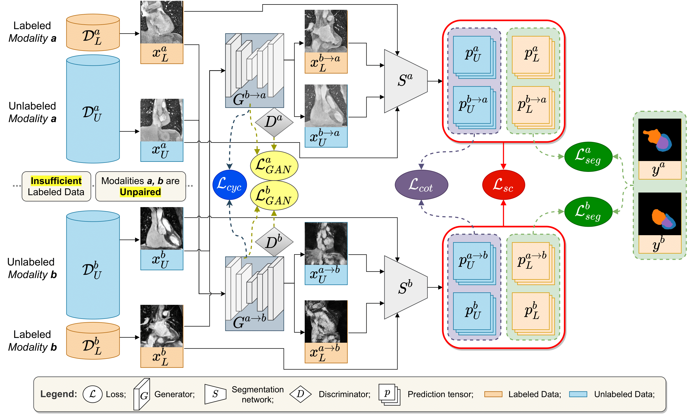

# SSUMML
Semi-Supervised Unpaired Multi-Modal Learning for Label-Efficient Medical Image Segmentation

by Lei Zhu, Kaiyuan Yang, Meihui Zhang, Ling Ling Chan, Teck Khim Ng and Beng Chin Ooi.

## Introduction
This repository is the Tensorflow implementation of our method for our newly introduced Semi-Supervised Unpaired Multi-Modal Learning, accepted by MICCAI 2021.

<br/>
<p align="center">
  
</p>


Our code will be release soon.


## Citation
If this respository is useful for your research, please consider citing:
```angular2html
@inproceedings{zhu2021ssumml,
  title={Semi-Supervised Unpaired Multi-Modal Learning for Label-Efficient Medical Image Segmentation},
  author={Lei Zhu, Kaiyuan Yang, Meihui Zhang, Ling Ling Chan, Teck Khim Ng and Beng Chin Ooi},
  booktitle={MICCAI}, 
  year={2021}
}
```


## Note
* Please feel free to drop me an email for any question.
* Contact: Lei Zhu (e0203764@u.nus.edu)
